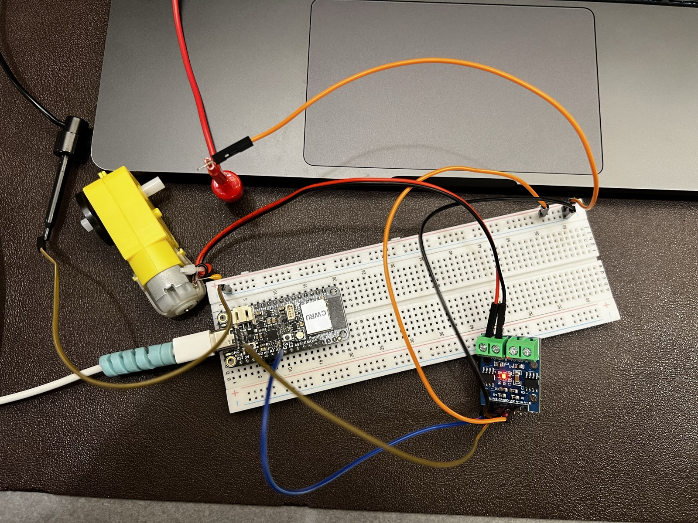
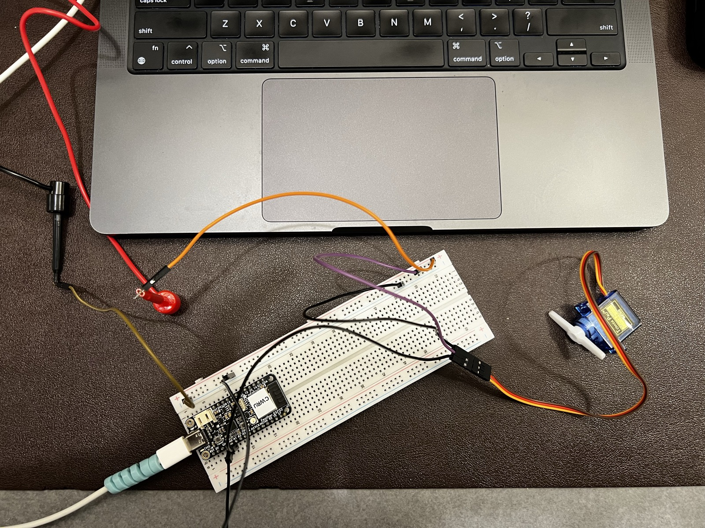

# Part 1: Working with Actuators (9/18)

## DC Motor

I amSameer Rahman and this is my third assignment working with ESP32 microcontroller and I plan on connecting actuators to this esp32. I am uploading the code i am writing in C++ via PlatformIO using a Mac computer. 

Changed the value for 255 to 150 and it stopped moving just made rumbling noises. Going up esstentially increased the speed and going below a certain threshold stopped the motor from spinning completely because of intertia it has to overcome.  Changing the delay changes the amount of time it remains on. Having a lower value then a higher value changes the speed after the set amount of delay. Changing MotorB_1B changed the direction of the spin. When I swapped the analogWrite() values between the two pins the motor spun the opposite direction. I changed the delay() from 5000 to 3000 so it only ran for 3 seconds instead of 5. In the final TT Motor.cpp the active value is 200 instead of 255.

### Wiring

The two wires from the TT motor go into the Motor B green terminal block on the motor driver. A1 on the ESP32 is connected to B-1A on the driver and A0 is connected to B-2A. The driver's VCC is powered from the bench power supply set to 3V and limited to 0.15A and the supply ground the driver GND and the ESP32 GND are all connected together as a common ground. The ESP32 itself is powered over USB from my laptop.

### Where to find the code

Both TT motor files are in the src folder of this Lab 4 folder.

1. [TT Motor.cpp](src/TT%20Motor.cpp) is the first half of the task. It runs the motor once in setup() and I changed the analogWrite() values, swapped them, and changed the delay(). Every change has a comment with the original value. Press the reset button on the ESP32 to run it again.
2. [TT Motor Rotate.cpp](src/TT%20Motor%20Rotate.cpp) is the second half. The motor runs clockwise for 5s then stops for 2s then runs counterclockwise for 5s then stops for 2s and loops.

### Circuit photo

The motor is wired to the Motor B terminals on the driver. A1 goes to B-1A and A0 goes to B-2A, and the driver, ESP32 and power supply all share a common ground.

## Servo Motor

### Wiring

The servo signal wire is connected to A0 on the ESP32. The servo is powered from the bench power supply set to 5V and limited to 0.75A, and the supply ground, the servo ground and the ESP32 GND are all connected together as a common ground.

### Where to find the code

Both servo files are in the src folder of this Lab 4 folder.

1. [Servo Motor.cpp](src/Servo%20Motor.cpp) sweeps the servo from 0 to 180 degrees and back to 0 in a loop. I changed minPulseWidth, maxPulseWidth, setPeriodHertz, the angle range and the delay one at a time to see what each one does, and the observations are below.
2. [Servo Motor Random.cpp](src/Servo%20Motor%20Random.cpp) moves the servo to random angles between 0 and 180 with a delay between each move.

### Observations

Lowered minPulseWidth from 500 to 200. The servo paused at the start of each sweep and the visible rotation was shorter because pulses under about 500 µs don't move the servo. Higher maxPulseWidth from 2500 to 4000  stops the motor prematurely too as it becomes out of range of the servo. The pauses increase with higher the max value. I also changed setPeriodHertz to 3000 from 50. This completely stopped the servo and made the movements very aperiodic. And making it 3 from 50 made it stop compeltely. Changing the angles from 180 to 90 in the for loop changed the sweep from full to half. I changed the delay from 15 to 5 and the sweep got faster. The delay is the wait after every one degree step, so a bigger delay means the servo moves slower and a smaller delay means it moves faster.

After that i uncommented and wrote the code to the next part which is random servo. The servo made random jumps between angles in random times.
# Part 2: Reflection

THis took me 2.5 hours.
- [ ] Easy
- [ ] Medium
- [x] Hard

I found it hard understanding the differences between values especially the Hertz. I realized that the values i chose where not producing meaningful differences. So I had to increase the values by a lot. At first I was worried I might break something if i did that so i did not do that. 

The course content seems fine and interesting this lab was just time consuming to figure out the map function and random (which does not select the highest number so i had to add 1 to it). No additional feedback.

