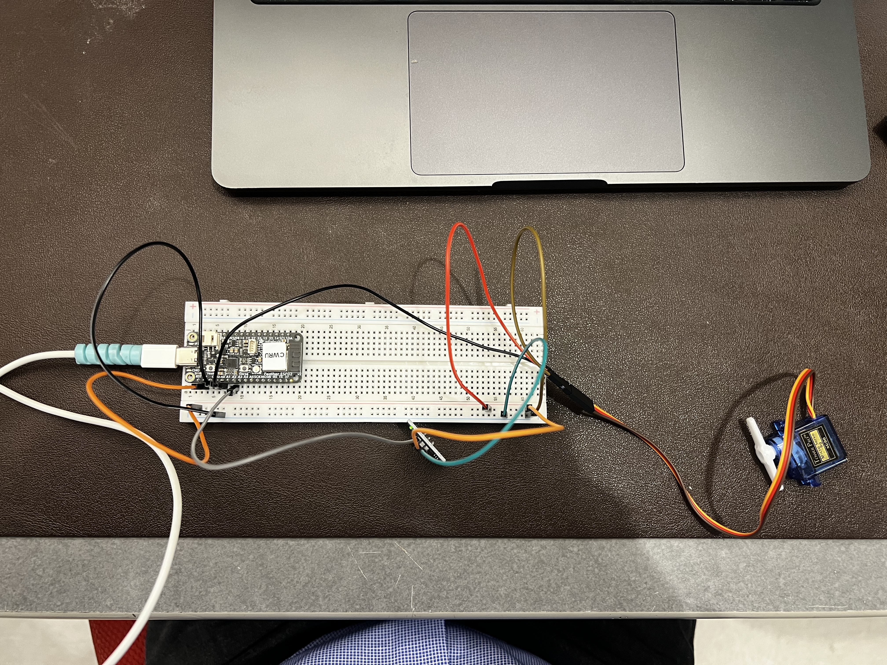

# Servo Motor and Touch Sensor Cat TOy
Hi my name is Sameer and i am now working on the last ESP32 assignment for the ECSE395 class. In this lab class I am using PlatformIO on VSCode on my Mac to push C++ code into the esp32. We are tasked on using one actuator and one sensor of our choice. I choose to use the Touch sensor module and the servo motors. This is because one of requirements for the cat toy is instant start when Olive touches with the nose.

## Desired behavior

When Olive touches the touch sensor the sensor reading goes over 2000 and the servo starts a 10 second play session where it moves to random angles with random pauses in between. The onboard LED stays on while it's playing to tell the user that its working. After the 10 seconds the LED turns off and the servo stops where it is and the toy waits 2 seconds before it checks for another touch to prevent accident touches.

## Wiring

The servo signal wire is on A0 same as Lab 4. The touch sensor signal wire moved from A0 to A2 since the servo is using A0 now. All the grounds are connected together as a common ground and the 3v3 is connected from esp32 to the common 3v3. so no bench power supply is being used.

The ESP32 is powered over USB-C from my laptop and the touch module is off the bottom of the breadboard and the servo is plugged into jumper wires on the right side.

## Where to find the code

[main.cpp](src/main.cpp) in the src folder. It's my Lab 3 touch code with my Lab 4 random servo code

## How the code works

This is the setup from both labs combined. LED_PIN and sensorPin come from Lab 3 touch.cpp and the Servo object, servoPin, randomAngle, pulseWidth and the min max pulse widths come from Lab 4 Servo Motor Random.cpp. The only new variable is lastAngle, which remembers where the servo moved last.

**setup().** Starts the serial monitor at 115200, sets the touch sensor pin as an input and the LED pin as an output and then attaches the servo to A0 with the 500 to 2500 µs pulse range and sets it to 50 Hz.

**loop().** Reads the touch sensor with analogRead() every 50 ms. If the value is over 2000 it means the cat is touching it and the play session starts

1. Turns the LED on and saves the current time with millis(). millis() is how many milliseconds the ESP32 has been on, so subtracting startTime from it tells how long the toy has been playing.
2. A while loop keeps going until 10000 mshave passed. 
   - Picks a random angle from 0 to 180 with random(0, 181). It's 181 because random() never picks the top number.
   - If the new angle is less than 40 degrees away from the last one it picks again. Without this the servo would sometimes go from like 90 to 93 and barely move, which a cat wouldn't care about. This way every move is a real jump
   - Uses map() to turn the angle into a pulse width between 500 and 2500 µs and sends it to the servo with writeMicroseconds()
   - Waits a random time between 0.5 and 1.5 s before the next move so the timing is random too and not a steady rhythm.
3. After 10 seconds the LED turns off and it prints that it's done.
4. delay(2000) is the cooldown. It stops one long touch from instantly starting another session right away.

If the sensor is under 2000 nothing happens and the servo just stays where it is. Thats were the problem lies. we need to experiment with different cat touches to get the threshold accurately. 

# Reflection

1. **How long did it take you to complete this assignment?** 
1.5 hours.
2. **What level of difficulty would you associate with this assignment**
 - [ ] Easy
 - [x] Medium
 - [ ] Hard
3. **If you associated medium/high difficulty with this assignment, what aspect did you find the most difficult?** 
Most of the code was from lab 3 and lab 4 so i did not feel lost. It was just hard to get the toy to realize a mistouch
4. **How comfortable do you currently feel with the course content?** Somewhat comfortable.
5. **Do you have any additional information or feedback you would like to share with the instructors?** 
no