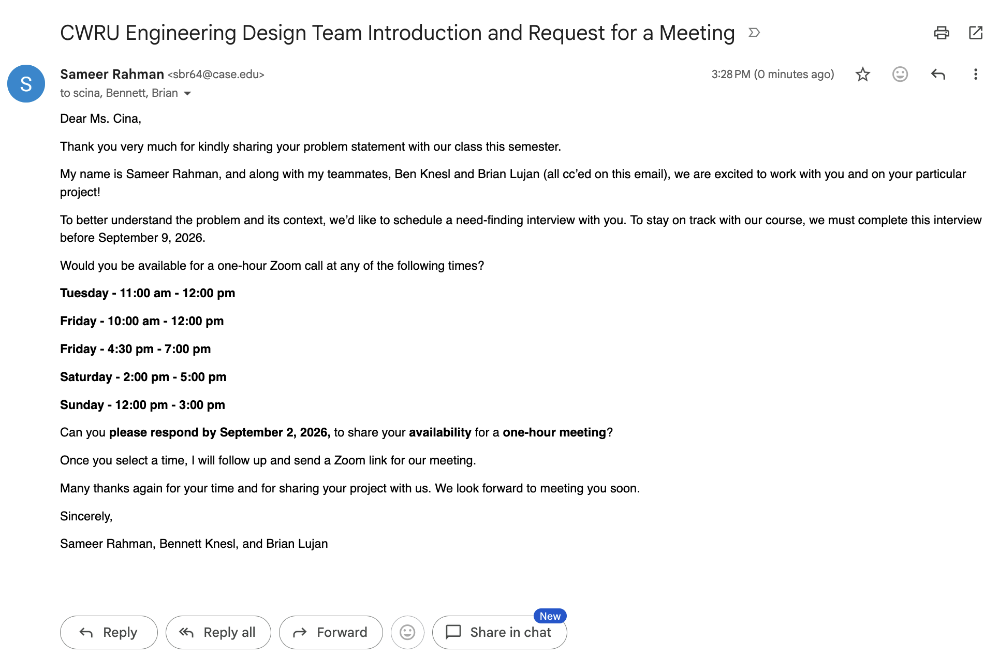

# Week 1 

(8/28) I met up with my teammates Ben and Brian in the second class of ECSE395. The first class was just an introduction to the roadmap and the course outcomes so we did not have the teams ready yet. Professor set up the teams using a CATME survery where he found out when our times matched and paired us out. We then ranked out the projects we deemed cool on the second day and got one of our top rated project **(How to keep my cat entertained)** which we ranked. I also had to make an introduction video talking about myself, my academics and my hobbies.  Afterwards, I drafted the stakeholder email which I had to draft twice because the first one got rejected. The second time we had to add another timeslot from the weekday in case the stakeholder has family obligations during the week. Then on Friday we met up in the Glennan Sears Lab to work on our github repositories and set them up. We also worked on the team contract process where I became the team leader, Ben became Secretary and Brian became Document Manager. We then made 3 additional bullet points to the expectations to add our own views of how a team should be functioning.

(8/28) Sent the stakeholder email to Ms. Cina (scina@fescenter.org) cc'ing Ben and Brian at 3:28 PM.

